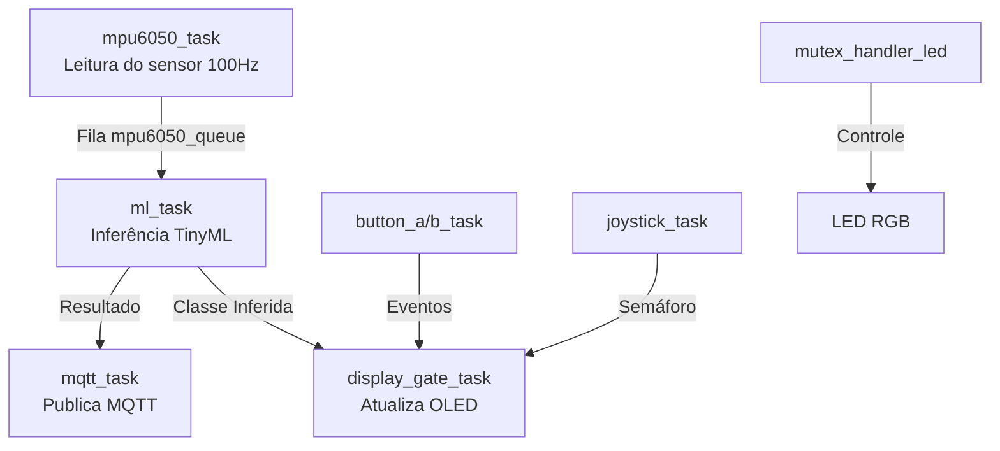

## 🖥️ 5. Arquitetura de Software

A aplicação é estruturada sobre o **FreeRTOS**, utilizando tarefas independentes que se comunicam por filas, semáforos e mutexes.

```mermaid
flowchart TD
    A[mpu6050_task <br> Leitura do sensor 100Hz] -->|Fila mpu6050_queue| B[ml_task <br> Inferência TinyML]
    B -->|Resultado| C[mqtt_task <br> Publica MQTT]
    B -->|Classe Inferida| D[display_gate_task <br> Atualiza OLED]

    E[button_a/b_task] -->|Eventos| D
    F[joystick_task] -->|Semáforo| D
    G[mutex_handler_led] -->|Controle| H[LED RGB]
```
